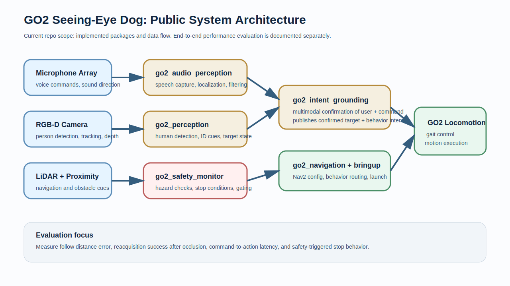

# GO2 Seeing-Eye Dog

> Assistive robotics thesis project on the Unitree GO2.

**Platform:** Unitree GO2 EDU + Jetson Orin  
**Status:** active hardware-backed development  
**Public repo status:** implemented subsystems are public; end-to-end evaluation is still in progress

## Project Goal

This project explores whether a quadruped can provide assistive guidance for visually impaired users in real environments. The emphasis is not broad autonomy marketing. It is a smaller, harder problem: reliably identifying the correct user, maintaining safe guidance behavior, and handling interruptions such as crowds, occlusion, and ambiguous voice commands.

## What Is Public In This Repo

This repository already contains real project structure and code, not only a thesis outline.

Public packages now:
- `go2_audio_perception` for microphone-array processing and sound-source localization
- `go2_perception` for human detection and tracking
- `go2_intent_grounding` for multimodal user confirmation logic
- `go2_safety_monitor` for obstacle and safety checks
- `go2_voice_commander` for speech command handling
- `go2_navigation` for Nav2 configuration
- `go2_msgs` for custom ROS 2 interfaces
- `go2_gait_controller` for a C++ gait controller and simulation test world
- `go2_bringup` for system launch

That matters because the repo should be judged as an active robotics system under construction, not as a mock research concept.

## System Scope

The target behavior set is intentionally narrow:

| Behavior | Intent |
|---|---|
| Come here | navigate to the calling user from rest |
| Follow me | maintain distance behind a confirmed user |
| Walk with me | support side-by-side accompaniment |
| Stop / wait | halt on command or safety event |
| Reacquire | recover after temporary loss or occlusion |

The research question is whether multimodal identity gating is more reliable than simpler baselines in shared spaces.

## Current Status

| Area | Public status |
|---|---|
| Repository structure | implemented |
| Custom ROS 2 messages | implemented |
| Audio perception package | implemented in repo |
| Visual perception package | implemented in repo |
| Intent grounding package | implemented in repo |
| Safety monitoring package | implemented in repo |
| Voice command package | implemented in repo |
| Gait controller package | implemented in repo |
| End-to-end human guidance benchmark | not yet published |
| Comparative evaluation vs baselines | not yet published |
| Final thesis behavior claims | still under validation |

## Baselines Under Consideration

| Baseline | Why it matters |
|---|---|
| AprilTag-only user following | simple visual baseline with explicit target identity |
| Phone-only localization or signaling | low-perception assistive baseline |
| Unitree stock follow behavior | platform-native comparison |
| Proposed multimodal system | voice + vision + navigation gating |

## Hardware

| Component | Role |
|---|---|
| Unitree GO2 EDU | locomotion platform |
| NVIDIA Jetson Orin | onboard compute |
| Intel RealSense D435i | RGB-D human perception |
| USB microphone array | audio localization and command capture |
| Mid-360 LiDAR | navigation and obstacle sensing |

## Software Stack

| Layer | Technology |
|---|---|
| Robot OS | ROS 2 Jazzy |
| Navigation | Nav2 |
| Perception | YOLOv8, OpenCV, RealSense SDK |
| Audio | PyAudio, SciPy, GCC-PHAT |
| Speech | Whisper local inference |
| Languages | Python 3, C++17 |

## Public Architecture

More detail: [ARCHITECTURE.md](ARCHITECTURE.md)

## Evaluation Plan

Measurement plan for the first public evaluation pass:

See: [EVALUATION.md](EVALUATION.md)

First metrics to add:
- follow distance error
- reacquisition success after occlusion
- command-to-action latency
- safety-triggered stop behavior

## Related Repositories

- [`ros2-go2-nav2-yolo`](https://github.com/yusufdxb/ros2-go2-nav2-yolo) isolates perception-to-navigation integration in simulation.
- [`go2-simple-workspace`](https://github.com/yusufdxb/go2-simple-workspace) is a narrower voice-control companion repo.

## Contact

**Yusuf Guenena**  
Wayne State University  
[yusuf.a.guenena@gmail.com](mailto:yusuf.a.guenena@gmail.com) · [LinkedIn](https://www.linkedin.com/in/yusuf-guenena)
