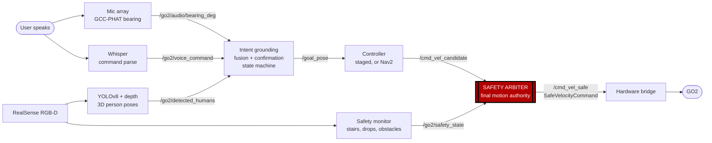

# GO2 Seeing-Eye Dog

**A ROS 2 stack that lets a blind or low-vision user call a Unitree GO2 quadruped across a room by speaking to it, and have the robot work out who called, where that person is standing, and walk to them.**

A guide dog has to be summonable. If the handler puts the harness down, sits on a bench, and then wants the dog back, the dog finds them by voice, not by an app or a joystick. A quadruped that needs a phone screen or a controller to be recalled is useless to the person it was bought for. That is the specific gap this repository closes: the recall half of the interaction, running on the real robot rather than in simulation, using only the microphones and the RGB-D camera the robot carries.

This repository is the hardware path. It is not the simulation workspace, and it does not contain a full autonomy state machine.

## One interaction, end to end

The user is roughly four metres away, off to the robot's left, in a room with two other people in frame. They say "hey robot, come here."

| Step | What happens | Evidence in the code |
|---|---|---|
| 1. Hear | A four-channel linear mic array (5 cm spacing) segments a 3-second window once the frame energy crosses a threshold, then runs GCC-PHAT across channel pairs for a time delay and an azimuth. | `go2_audio_perception/audio_perception_node.py`, published on `/go2/audio/bearing_deg` |
| 2. Understand | Whisper (`base.en`) transcribes the same window, and a keyword map turns free text into one of `come here`, `follow`, `stop`, `help`. | `go2_voice_commander/voice_commander_node.py`, published on `/go2/voice_command` |
| 3. See | YOLOv8 detects people in the RealSense RGB frame, and each box is back-projected through the depth image and camera intrinsics into a 3D pose. | `go2_perception/perception_node.py`, published on `/go2/detected_humans` |
| 4. Decide who | Each detected person's bearing is converted from the camera optical frame into the body frame, then gated: beyond 25 degrees from the acoustic bearing they are not the caller. Inside the gate, visual confidence is modulated by acoustic corroboration. Perfect agreement returns the detector's own confidence; disagreement discounts it. | `go2_intent_grounding/fusion.py`, `bearings.py` |
| 5. Commit | A voice request is **required**. The best candidate must clear the threshold on 5 consecutive frames before the target locks; the request times out with an explicit reason if it does not. The locked pose is transformed into `map` and published as a goal. | `go2_intent_grounding/intent_grounding_node.py`, `grounding_state.py` |
| 6. Move, under authority | A controller turns the goal into a *candidate* velocity. The safety arbiter validates it, clamps it to the configured envelope, rate-limits it, and stops entirely for a depth-detected hazard. Only its output reaches the actuator, and only while the arbiter is alive: the bridge runs its own monotonic watchdog and stops the robot if the arbiter goes quiet for any reason. | `go2_safety_arbiter/`, `go2_hardware_bridge/` |


```mermaid
flowchart LR
  U([User speaks]) --> MIC[Mic array<br/>GCC-PHAT bearing]
  U --> ASR[Whisper<br/>command parse]
  CAM[RealSense RGB-D] --> YOLO[YOLOv8 + depth<br/>3D person poses]
  MIC -->|/go2/audio/bearing_deg| FUSE
  ASR -->|/go2/voice_command| FUSE
  YOLO -->|/go2/detected_humans| FUSE[Intent grounding<br/>fusion + confirmation<br/>state machine]
  FUSE -->|/goal_pose| CTRL[Controller<br/>staged, or Nav2]
  CTRL -->|/cmd_vel_candidate| ARB
  CAM --> SAFE[Safety monitor<br/>stairs, drops, obstacles]
  SAFE -->|/go2/safety_state| ARB[["SAFETY ARBITER<br/>final motion authority"]]
  ARB -->|/cmd_vel_safe<br/>SafeVelocityCommand| BR[Hardware bridge]
  BR --> GO2([GO2])
  style ARB fill:#b30000,stroke:#000,stroke-width:3px,color:#fff
```

The arbiter is drawn in the middle of the motion path because that is where it
sits. It is not an advisor with a dashed line to something else; it owns the
actuator's input. `/cmd_vel_candidate` and `/cmd_vel_safe` carry **different
message types**, so a controller cannot deliver a command to the bridge even
if it is misconfigured to try.


## Status

Unitree GO2 EDU with an onboard Jetson, ROS 2 Humble. Split by what has actually been run, not by what exists.

| Capability | Implemented | Tested | Validated on the robot |
|---|---|---|---|
| Audio bearing (GCC-PHAT) | Yes | Unit | No. Thresholds and the left/right sign convention are mic- and mount-specific. |
| Voice command parsing (Whisper) | Yes | Unit | No |
| Person detection (YOLOv8 + depth) | Yes, stock `yolov8n` weights | No | No |
| Audio-visual fusion | Yes | Unit + node | No |
| Caller confirmation state machine | Yes | Unit + node | No |
| Goal emission requires a voice request | Yes | Node | No |
| Staged approach controller | Yes | Unit + node | No |
| **Safety arbiter with final motion authority** | **Yes** | **Unit + node + integration** | **No** |
| **Hardware bridge fails closed** | **Yes** | **Node + integration** | **No** |
| End-to-end decision path (dry-run) | Yes | Integration | No |
| Safety monitor (stairs, drops, obstacles) | Yes | No | No |
| Nav2 integration | Wired, **never successfully launched** | No | No |
| Physical GO2 actuation | Adapter written, **never executed** | No | **No** |
| Speaker verification / authorized user | **No** | n/a | n/a |
| Obstacle avoidance (as opposed to stopping) | **No** | n/a | n/a |
| Guiding or leading the user | **No.** This repository recalls the robot; it does not walk the user anywhere. | n/a | n/a |

**298 tests pass**, covering pure functions, ROS node behaviour, state
machines, launch wiring, an end-to-end dry-run integration path, and
regressions for every defect closed by the adversarial safety audit. Reproduce
with `./scripts/reproduce.sh`.

The safety guarantee is bounded by one assumption, stated wherever it appears:
**a trusted DDS domain.** ROS 2 without SROS2 has no authentication, so any
process that can reach the robot's network has the same privileges as the
safety arbiter. The architecture reliably stops a misconfigured controller, a
stray `ros2 topic pub`, a crashed process, a stalled simulation clock and a
mistyped parameter, all demonstrated. It does not stop an adversary already on
that network. [`docs/safety_architecture_audit.md`](docs/safety_architecture_audit.md)
reports the audit in full, including the findings that remain open.

Every number quoted in this README is a default parameter value in the source,
not a measured field result. **No code in this repository has ever moved a
physical robot.** Every actuation it has performed went to a dry-run adapter
that records commands to a file. See
[docs/research_system_claims.md](docs/research_system_claims.md) for the
claim-by-claim breakdown.

A custom four-class perception model (owner, wrist marker, phone marker, follow marker) is specified in [DATA.md](DATA.md), but the dataset is still being collected and the shipped default is stock YOLOv8.

## Repository Layout

```text
go2_audio_perception/   GCC-PHAT bearing estimate and NeMo ASR bridge
go2_voice_commander/    Whisper-based command parsing
go2_perception/         YOLOv8 + depth back-projection
go2_intent_grounding/   Audio/voice/vision fusion and caller confirmation
go2_safety_monitor/     Depth-based hazard detection
go2_approach_controller/ Staged candidate-motion producer (Nav2 stand-in)
go2_safety_arbiter/     FINAL AUTHORITY over all motion commands
go2_hardware_bridge/    Adapter contract; dry-run and Unitree Sport API adapters
go2_navigation/         Nav2 params and behavior trees (Stage 2)
go2_bringup/            Canonical launch graph and versioned configuration
go2_msgs/               Shared ROS 2 message definitions
go2_gait_controller/    C++ lifecycle gait controller
evaluation/             Offline evaluation utilities and tests
scripts/                Deterministic repo-local workflow entrypoints
docs/                   Architecture, debugging, ROS graph, release docs
```

## Setup

1. Install ROS 2 Humble and source it.
2. Install system dependencies required by this repo:
   - `python3-pip`
   - `python3-colcon-common-extensions`
   - `python3-rosdep`
   - `portaudio19-dev`
3. Bootstrap Python and ROS dependencies:

```bash
./scripts/bootstrap.sh
```

If `rosdep` or ROS 2 is missing, the bootstrap script will say so instead of pretending the environment is complete.

## Build

```bash
source /opt/ros/humble/setup.bash
colcon build --symlink-install --packages-select go2_msgs
source install/setup.bash
colcon build --symlink-install --packages-up-to go2_bringup
```

Why `go2_msgs` first: the Python packages depend on generated interfaces, and
the safety contract is itself a generated type. Failing to build messages first
creates avoidable import breakage.

Or build and test everything from clean, on an isolated ROS domain:

```bash
./scripts/reproduce.sh
```

## Test And Validate

Run these before claiming progress:

```bash
./scripts/reproduce.sh     # clean build + full suite on an isolated ROS domain
```

Or individually:

```bash
./scripts/lint.sh
./scripts/test.sh
./scripts/validate.sh
```

What they cover:

- `scripts/lint.sh`: `ruff` plus XML sanity for behaviour trees
- `scripts/test.sh`: the test suite. Without ROS on the path the node,
  integration and launch tests skip themselves, which is what the ROS-free CI
  job exercises.
- `scripts/validate.sh`: bytecode compilation plus `repo_doctor.py`, which
  fails if the safety architecture has been violated statically, a bridge
  naming a candidate topic, a second publisher of the safe-command topic, a
  launch file starting an actuator outside `motion_authority.launch.py`,
  arbiter and bridge limits drifting apart, or the hardware-validation
  disclaimer being removed.
- `scripts/reproduce.sh`: all of the above from a clean build, on a ROS domain
  it first verifies is empty. These tests assert on what does and does not
  reach an actuator, and a foreign graph can make such an assertion pass or
  fail for the wrong reason.

## Run

```bash
source /opt/ros/humble/setup.bash
source install/setup.bash

# The whole decision stack, no hardware at all. Publish perception inputs
# yourself (a bag, a fixture, or ros2 topic pub).
ros2 launch go2_bringup system_dry_run.launch.py

# Real perception (needs a 4-channel mic, a RealSense and YOLO weights),
# dry-run actuation.
ros2 launch go2_bringup system.launch.py

# Physical actuation. Deliberate, and never executed against a GO2 by this
# repository.
ros2 launch go2_bringup system.launch.py hardware_adapter:=unitree_sport
```

Arguments: `perception:=real|none`, `planner:=staged|nav2`,
`hardware_adapter:=dry_run|unitree_sport|unitree_avoid`.

`dry_run` is the default everywhere. Selecting a physical adapter has to be
typed out, and there is no fallback from it: asking for hardware without the
Unitree SDK is a hard failure, not a silent downgrade to a simulator.

The quickest check that the architecture is intact on a running system:

```bash
ros2 topic info /cmd_vel_safe --verbose   # MUST show exactly one publisher
ros2 topic echo /go2/safety/status        # what the arbiter is deciding, and why
ros2 topic echo /go2/bridge/status        # what actually reached the actuator
```

## Native obstacle avoidance transport (`unitree_avoid`)

`hardware_adapter:=unitree_avoid` is the Sport adapter plus an opt-in velocity
path through the Unitree `obstacles_avoid` service. It starts on Sport and is
byte-for-byte `unitree_sport` until a client switches it on:

- Service `/go2/obstacle_avoidance/set` (`std_srvs/srv/SetBool`), `data: true` to enable.
- Topic `/go2/obstacle_avoidance/state` (`std_msgs/msg/Bool`, reliable, transient_local):
  true only after a verified read-back.
- Enable = SwitchSet `{"enable": true}` (api 1001 on `/api/obstacles_avoid/request`),
  reply code 0, then SwitchGet (api 1002) must read back `{"enable": true}`; only then
  does velocity go out as obstacles_avoid Move (api 1003, `{"x","y","yaw","mode":0}`,
  noreply) instead of Sport Move 1008. Any error, timeout or wrong read-back leaves
  the transport on Sport and the state false. The request is refused while a non-zero
  velocity was transmitted within `authority_handover_quiet_sec`, and while the
  adapter does not support it. `dry_run` accepts the request and SIMULATES the switch
  (it logs the calls to the JSONL record, nothing is transmitted).
- Stops on the avoid transport send obstacles_avoid Move(0,0,0) and then Sport
  StopMove. Damp is never sent. Api ids are always handled as (topic, id) pairs
  because 1001 is Damp on Sport and SwitchSet on obstacles_avoid.
- The switch is read once at connect and restored to that prior value on node
  shutdown (if it was known and this node changed it).
- Parameters: `obstacles_avoid_timeout_sec` (1.5), `obstacles_avoid_api_remote_control`
  (false). UseRemoteCommandFromApi (api 1004) is sent only when the latter is true.
- `/diagnostics` adds `obstacle_avoidance_enabled`, `obstacle_avoidance_transport`,
  `obstacle_avoidance_prior_value`.

**HW-UNVERIFIED** (the only hardware fact: on 2026-09-21 SwitchSet(true) returned
code 0, SwitchGet read back true, and a zero Move with the switch on produced no
motion):

- A non-zero Move through obstacles_avoid has never been tested on this GO2.
- Whether Sport StopMove halts motion commanded through obstacles_avoid is untested.
- Whether Move works without UseRemoteCommandFromApi (1004) is untested; 1004 may mask
  the physical remote, so it is off by default.
- Move modes 1 and 2 and the avoid-mode selector are deliberately unused.

## Troubleshooting

- Missing package error during launch:
  run `./scripts/validate.sh` and check whether `nav2_bringup`, `realsense2_camera`, and repo packages resolve in the active ROS environment.
- Launch dies with behavior tree error:
  ensure `go2_navigation/behavior_trees/navigate_to_pose_recovery.xml` is installed by rebuilding `go2_navigation`.
- No `/goal_pose` output:
  first check `ros2 topic echo /go2/grounding_status`, which states the reason
  directly: `NO_REQUEST` (no voice command was received; one is required),
  `NO_DETECTIONS`, `BEARING_MISMATCH` (seen and heard in different directions),
  `LOW_CONFIDENCE`, or `CONFIRMATION_TIMEOUT`. If the state reaches `CONFIRMED`
  but no goal appears, the TF lookup failed: check
  `ros2 run tf2_ros tf2_echo map camera_color_optical_frame`.
- The robot will not move:
  check `ros2 topic echo /go2/safety/status`. The `state` and `reason_codes`
  fields say exactly why. `SAFETY_CONTEXT_STALE` means the safety monitor is not
  publishing, which is a stop by design. `WATCHDOG_TIMEOUT` means no candidate
  is arriving. `EMERGENCY_STOP` means the latch is engaged and only
  `ros2 service call /safety_arbiter_node/release_estop std_srvs/srv/Trigger`
  will clear it.
- The robot moves more slowly than commanded:
  that is the arbiter clamping and rate-limiting. `intervention_count` and
  `last_intervention_reasons` in `/go2/safety/status` confirm it. Limits are in
  `go2_bringup/config/safety.yaml`, and none of them has been validated on
  hardware.
- Perception idle:
  verify `/camera/color/image_raw`, `/camera/depth/image_rect_raw`, and camera info topics are publishing.
- Safety monitor never alerts:
  inspect `/go2/safety_state` and confirm depth values are nonzero and in millimeters.
- Voice command quality is poor:
  retune `energy_threshold` for the actual microphone chain and ambient noise level.

## Operational Notes

- Camera streams are subscribed with `BEST_EFFORT`; camera-info QoS compatibility still needs runtime verification against the actual driver.
- Audio thresholds and hazard thresholds are hardware- and mounting-dependent. Do not treat them as portable constants.

## Audio Compatibility

| Model | Audio | Notes |
|---|---|---|
| Go2 EDU | Yes | Microphone hardware present and captured on the unit used here |
| Go2 Pro | Yes | Expected to work (same hardware) |
| Go2 Air | No | No microphone hardware |

## Documentation

Start here:

- [`docs/target_runtime_architecture.md`](docs/target_runtime_architecture.md), the architecture, its invariants, and an honest account of the Nav2 situation
- [`docs/research_system_claims.md`](docs/research_system_claims.md), what may and may not be claimed, claim by claim
- [`docs/END_TO_END_UPGRADE_REPORT.md`](docs/END_TO_END_UPGRADE_REPORT.md), what changed and why

Reference:

- [`docs/safety_architecture_audit.md`](docs/safety_architecture_audit.md), adversarial review of the safety design
- [`docs/runtime_graph_audit.md`](docs/runtime_graph_audit.md), what this repository was before, in detail
- [`docs/ros_graph.md`](docs/ros_graph.md), topics, services, QoS, frames
- [`docs/architecture.md`](docs/architecture.md), short orientation
- [`docs/debugging.md`](docs/debugging.md)
- [`docs/hardware_assumptions.md`](docs/hardware_assumptions.md)
